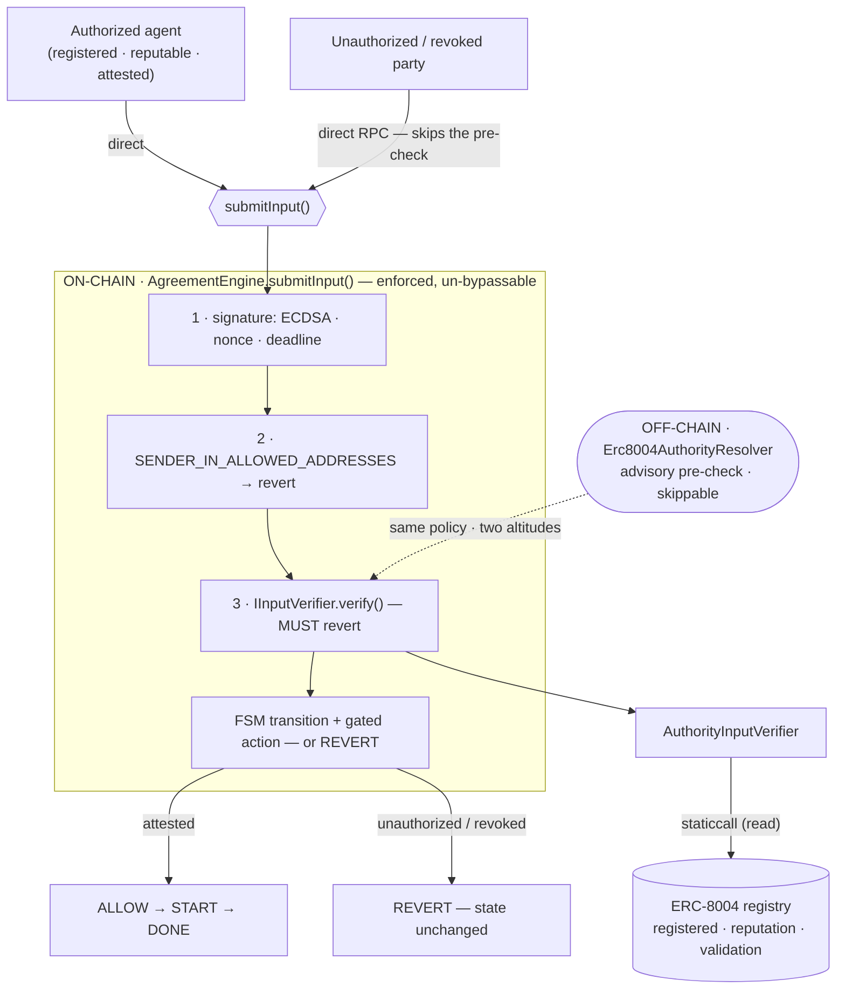

# On-chain authority enforcement (v2) — trace

Branch `experiment/onchain-authority-verifier-v2`. Answers: *"if the off-chain resolver is bypassable by
direct RPC, what on-chain stops an unauthorized transition?"* — by moving the rich-authority check into a
real `IInputVerifier` the engine calls on every `submitInput`. Un-bypassable: the engine itself invokes it.

## What was built (no kernel change — uses the existing `verifierKeys` hook)

- `contracts/src/AuthorityInputVerifier.sol` — an `IInputVerifier` that `staticcall`s an ERC-8004-style
  registry for `msg.sender` and REVERTS if unregistered / below a reputation floor / missing a required
  validation. The **on-chain twin** of the off-chain `Erc8004AuthorityResolver` (cns-service a2a slice):
  same policy, enforced not advised. Registry is config (points at real ERC-8004 / an EAS adapter on
  mainnet) — the neutral seam.
- `contracts/src/MockErc8004Registry.sol` — minimal registry for the trace (register / setReputation /
  addValidation / revoke).
- `contracts/test/onchain-authority-verifier.test.ts` — the trace.

## The trace (direct-RPC `submitInput`, on the Hardhat EVM)

```
on-chain authority enforcement (AuthorityInputVerifier / v2)
  ✔ REVERTS a direct-RPC submitInput from an unregistered sender
  ✔ REVERTS a sender registered but below the reputation floor
  ✔ REVERTS a reputable sender missing the required validation
  ✔ PASSES a registered, reputable, attested sender — the transition applies on-chain
  ✔ REVERTS after the sender's registration is revoked (on-chain off-switch)
5 passing   ·   full contracts suite: 91 passing (no regression)
```

An unauthorized party calling `submitInput` **directly** (the exact path that bypasses the off-chain
resolver) is rejected **on-chain** and the FSM does not advance; an attested party passes and the state
transitions; revoking registration re-blocks the same signer. That is the "gated consequence" gated on-chain.

## Boundary (honest)

Still v2, off-chain-registry-trusted: the on-chain gate is only as good as the ERC-8004 / EAS registry it
reads (and its writers). It does not verify a full ERC-7710 delegation chain on-chain (that is v1b / v3 in
the design doc). What it DOES prove: the enforcement point is real, on-chain, and un-bypassable — the deny
is no longer advisory. Local Hardhat EVM trace; no public testnet; not audited.

## Architecture


