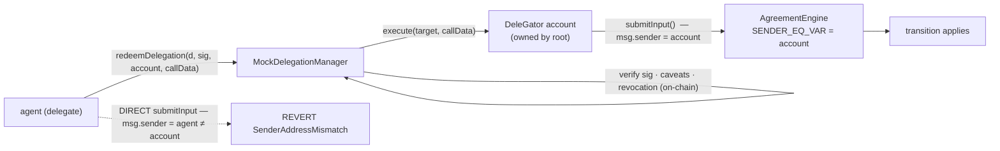

# On-chain authority (v3) — the DelegationManager route, composition answered

Branch `experiment/onchain-authority-verifier-v3` (off v2). Answers the design-doc v3 open question:
*"when a delegate redeems a delegation that calls `submitInput`, who is `msg.sender` to the engine, and does
`SENDER_EQ` / `SENDER_IN_ALLOWED` match a contract sender?"* — with a faithful MODEL of MetaMask's ERC-7710
DelegationManager + DeleGator, so the composition and gas can be traced on a devnet before any real bytecode.

## The route (engine UNCHANGED)



The agreement binds `SENDER_EQ_VAR_ADDRESS` to the delegator's **account** (a stored ADDRESS var). The
DelegationManager gates *who may cause that account to act*: it verifies the root's EIP-712 signature, the
caveats (allowed target + selector), and the revocation state on-chain (state-changing — which is why a
`view` verifier could not do this), then the account executes the call, so the engine sees `msg.sender =
account`. No engine change (existing `SENDER_EQ_VAR_ADDRESS` condition; C-0036 preserved).

## Trace

```
on-chain authority via DelegationManager route (v3)
  ✔ REVERTS the agent's DIRECT submitInput — the agent is not the authorized sender (the account is)
  ✔ PASSES via redemption — the engine sees msg.sender = the delegator account (composition answered)
  ✔ REVERTS a redemption after the delegation is disabled (on-chain off-switch)
  ✔ REVERTS when a non-delegate tries to redeem
  ✔ REVERTS a caveat violation — a call whose selector the delegation did not authorize
5 passing   ·   full contracts suite: 96 passing (no regression)
[gas] redeemDelegation → account.execute → submitInput: 114,318 gas
```

## What this answers (the v3 blockers, from the design doc)

- **`msg.sender` composition — ANSWERED.** The engine sees `msg.sender = the delegator's smart account`,
  not the redeeming agent. A direct call by the agent reverts (`SenderAddressMismatch`); only redemption
  (which routes through the account) satisfies `SENDER_EQ_VAR`. So an unchanged engine works with the
  DelegationManager route by allow-listing the account.
- **Contract `msg.sender` — ANSWERED.** `SENDER_EQ_VAR_ADDRESS` matches a contract sender fine.
- **Gas headroom — MEASURED.** The full redemption→execute→submitInput stack is **~114k gas** — an
  ordinary transaction, not prohibitive.
- **On-chain enforcement + off-switch — SHOWN.** Sig / caveats / revocation are enforced in the manager
  before execution; `disable()` blocks a redemption on-chain.

## Boundary (honest — say it before Rob does)

- `MockDelegationManager` / `MockDelegatorAccount` are **MODELS** of MetaMask's audited contracts, NOT the
  real ones. The real `DelegationManager` + DeleGator drop in on mainnet/testnet; the interface shape and
  the composition are what's proven here.
- The delegation is signed by an **EOA** root (`ECDSA`). The real DeleGator is an ERC-4337 smart account
  whose owner may itself be a contract → needs **ERC-1271** (the D-0039 gap) for that leg; not covered here.
- Only the **two load-bearing caveats** (allowed target + selector) are modeled; the real framework has
  ~37 caveat enforcers, which slot in the same place.
- **Persona mismatch stands:** this assumes the counterparty runs a 4337 DeleGator; grant operators
  typically run a Safe multisig. That is the reason v3 is pilot-grade, not the first ship.
- Local Hardhat EVM; no public testnet; not audited.

## v3 vs v2

v2 gates on an on-chain ERC-8004/EAS **registry** (trust the registry + its writers; cheapest; works with
any signer today). v3 gates on a **cryptographic delegation** (root signature + caveats + on-chain
revocation) enforced by an audited singleton — the strongest maximalist signal ("authority enforced via
MetaMask's DelegationManager on-chain"), but heavier and 4337-dependent. They are complementary: register
either (or both) behind the seam.
