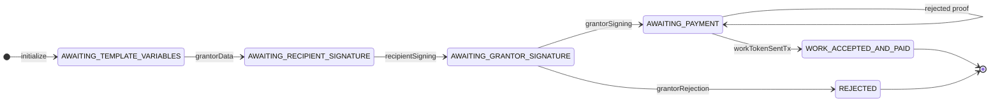
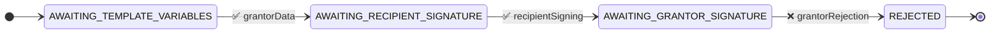

# Simple Grant Agreement State Machine

Payment boundary: this fixture models agreement state and a submitted payment proof. It does not custody funds or execute ETH/ERC-20 transfers natively. ERC-20 transfer execution is demonstrated separately by the auto-pay action fixtures, where a configured action calls an external token contract.

## Test Scenarios

### 1. Happy Path
This test verifies the successful completion of a grant agreement where all parties agree and the grantor submits a payment proof.

```mermaid
stateDiagram-v2
    direction LR
    [*] --> AWAITING_TEMPLATE_VARIABLES
    AWAITING_TEMPLATE_VARIABLES --> AWAITING_RECIPIENT_SIGNATURE: ✅ grantorData
    AWAITING_RECIPIENT_SIGNATURE --> AWAITING_GRANTOR_SIGNATURE: ✅ recipientSigning
    AWAITING_GRANTOR_SIGNATURE --> AWAITING_PAYMENT: ✅ grantorSigning
    AWAITING_PAYMENT --> WORK_ACCEPTED_AND_PAID: ✅ workTokenSentTx
    WORK_ACCEPTED_AND_PAID --> [*]
```

Test Steps:
1. Grantor submits initial data
2. Recipient signs the agreement
3. Grantor approves and signs
4. Payment proof is submitted

### 2. Rejection Path
This test verifies that the grantor can reject the agreement after the recipient has signed.

Test Steps:
1. Grantor submits initial data
2. Recipient signs the agreement
3. Grantor rejects the agreement

### 3. Rejected Payment-Proof Path
This test verifies that unauthorized or invalid payment-proof submissions are rejected and the state remains unchanged.

```mermaid
stateDiagram-v2
    direction LR
    [*] --> AWAITING_TEMPLATE_VARIABLES
    AWAITING_TEMPLATE_VARIABLES --> AWAITING_RECIPIENT_SIGNATURE: ✅ grantorData
    AWAITING_RECIPIENT_SIGNATURE --> AWAITING_GRANTOR_SIGNATURE: ✅ recipientSigning
    AWAITING_GRANTOR_SIGNATURE --> AWAITING_PAYMENT: ✅ grantorSigning
    AWAITING_PAYMENT --> AWAITING_PAYMENT: ❌ rejected proof
```

Test Steps:
1. Grantor submits initial data
2. Recipient signs the agreement
3. Grantor approves and signs
4. Unauthorized or invalid payment proof is submitted
5. State remains in AWAITING_PAYMENT

Note: The test suite runs these scenarios twice:
- Once with "unwrapped" inputs (raw JSON)
- Once with "wrapped" inputs (VerifiedCredential format)
